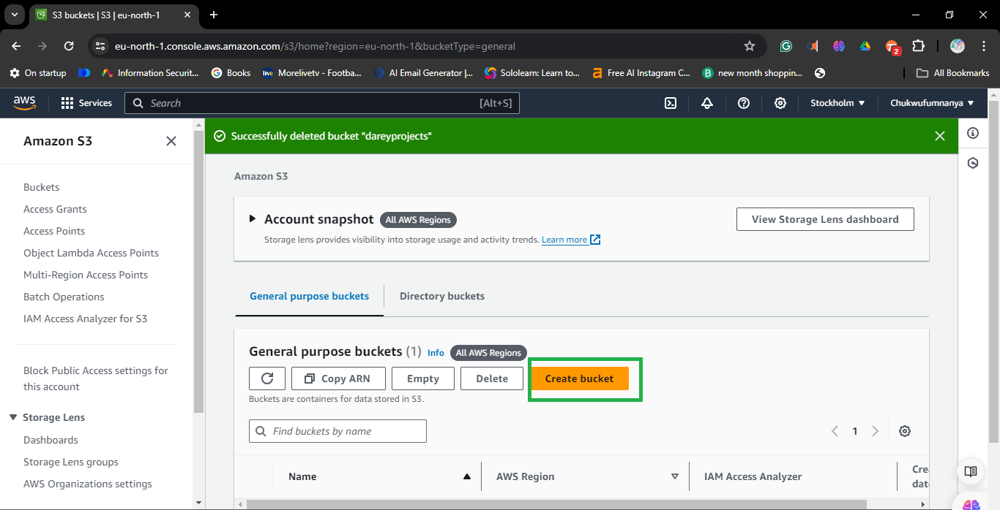

# Aws bucket policy Exploration 

### Purpose:

In this mini project, you will work with Amazon S3 bucket policies to control access to your S3 buckets. The project will guide you through creating a simple S3 bucket, defining a policy to manage access permissions, and testing the policy by uploading and retrieving objects.

1. ** Log in to the AWS Management Console.**
   ```
   Open your web browser and go to (https://aws.amazon.com/console/).
   Enter your username and password.
   Click "Sign In".
   ```
2. **Navigate to the S3 service:**
   ```
   Once logged in, at the top of the AWS Management Console, you'll see a search bar. 
   Type in "S3" and select "Amazon S3" from the search results.
   ```

3. **Click the "Create bucket" button:**
   ```
   In the Amazon S3 dashboard, click the "Create bucket" button.
   This will open a new window where you can configure your bucket.
   ```
   

4. **Follow the prompts to configure the new S3 bucket:**
   
   **Bucket Name and Region:**
   ```
   Enter a unique bucket name.
   Select the region for your bucket.
   ```

   **Configure Options (Optional):**
   `Set up options such as versioning, logging, and tags as needed.`
   
   **Set Permissions:**
  ` Define who can access the bucket and the objects inside it.`
   
   **Review:**
   `Double-check all the configurations you've made.`
   
   **Create Bucket:**
   `Click the "Create bucket" button to finalize the process.`
   

5. **Confirmation:**
   Once the bucket is created, you'll see a confirmation message.
   You can now start uploading files to your new S3 bucket!
   


6. **Upload a test object to your S3 bucket:**
   ```
   Open the bucket you created.
   Create a folder
   Open the folder
   Click the "Upload" button.
   Select a test file from your local computer and upload it to the bucket.
   ```

   - **Using AWS CLI:**
     - Open your terminal or command prompt.
     - Use the AWS CLI command to upload a test file:
       ```bash
       aws s3 cp /path/to/testfile s3://your-bucket-name/
       ```
     - Replace `/path/to/testfile` with the path to your local test file.
     - Replace `s3://your-bucket-name/` with the S3 URI of your bucket.

2. **Retrieve the object from various scenarios:**
   - **Use an allowed IP address:**
     - Access the object from a network with an IP address that you have allowed in the bucket policy or IAM policy.
     - You should be able to successfully retrieve the object.

   - **Use a restricted IP address:**
     - Access the object from a network with an IP address that is restricted in the bucket policy or IAM policy.
     - You should receive an access denied error or similar message indicating the restriction.

   - **Use different IAM users:**
     - Create multiple IAM users with different permissions.
     - Attempt to access the object using each IAM user's credentials.
     - Verify the access based on the permissions assigned to each IAM user.

3. **Observing Access Control:**
   - **Allowed IP Address:**
     - If the IP address is allowed, you should be able to successfully retrieve the object.
     - Check the AWS CloudTrail logs or S3 server access logs for verification.

   - **Restricted IP Address:**
     - If the IP address is restricted, you should receive an access denied error.
     - Check the AWS CloudTrail logs or S3 server access logs for details on the denied request.

   - **IAM Users:**
     - Verify that IAM users with appropriate permissions can retrieve the object.
     - IAM users without the necessary permissions should receive an access denied error.

4. **Testing Complete:**
   - After testing with various scenarios, you have observed the access control configurations of your S3 bucket.
   - This helps ensure that your S3 bucket is configured securely according to your access requirements.

5. **Additional Steps (Optional):**
   - You can further refine your bucket policies, IAM policies, or bucket ACLs based on your testing results.
   - Regularly monitor access logs and CloudTrail logs to detect any unauthorized access attempts.


