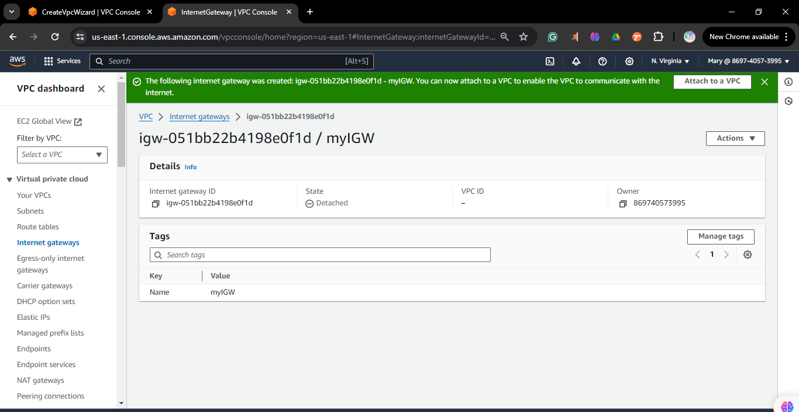
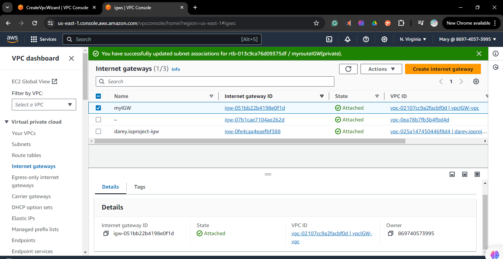

# Creating Internet Gateway and NAT Gateway with Route Table Configuration

## Task 1: Create an Internet Gateway

1. **Navigate to the VPC service**

   - In the AWS Management Console, search for "VPC" or find it under the "Networking & Content Delivery" section.
   - Click on the "VPC" service to open it.
   - create a "VPC" for this project

2 **Create subnets for the "VPC"**
   - create a public and private subnet for the "VPC"
     

3. **Click on "Internet Gateways" in the left navigation pane**
   - In the VPC dashboard, locate the "Internet Gateways" option in the left navigation pane.
   - Click on "Internet Gateways" to view the list of Internet gateways.

4. **Click the "Create internet gateway" button**
   - give the "internet gateway" name
   - In the "Internet Gateways" page, click on the "Create Internet Gateway" button located at the top of the page.
     

6. **Attach the newly created internet gateway to your VPC**

   - After creating the internet gateway, select the newly created internet gateway from the list.
   - Click on the "Actions" button and choose "Attach to VPC".
   - Select the VPC you want to attach the internet gateway to from the dropdown menu.
   - Click the "Attach internet gateway" button to complete the attachment process.
     

## Task 2: Create a NAT Gateway

1. **In the VPC dashboard, click on "Nat Gateways"**
   - Find and click on "Nat Gateways" in the left navigation pane to manage NAT gateways.
   - Once you're in the "Nat Gateways" section, click on the "Create Nat Gateway" button.
     
3. **Configure the NAT Gateway, associating it with a public subnet and an Elastic IP address**

   - In the configuration wizard, you'll first need to select the subnet for your NAT gateway. Choose the public subnet you want to associate with the NAT gateway from the dropdown menu.
   - Next, allocate an Elastic IP address to associate with the NAT gateway by clicking the "Allocate Elastic IP address" button and following the prompts.
   - After selecting the appropriate subnet and Elastic IP address, review the configuration settings to ensure they are correct.
   - Finally, click the "Create Nat Gateway" button to create the NAT gateway.
      

## Task 3: Configure Route Tables

1. **In the VPC dashboard, click on "Route Tables."**
   - Find and click on "Route Tables" in the left navigation pane to manage route tables.
   - Click on the "Create Route Table" button.
   - Give the route table a name and select your VPC to associate it with.
   - Click on the "Create" button to create the new route table.

2. **Edit the routes of the new route table to include a route to the internet via the internet gateway**

   - Select the newly created route table from the list.
   - Click on the "Routes" tab.
   - Click on the "Edit routes" button.
   - Add a new route with destination `0.0.0.0/0` and target as the internet gateway created earlier.
   - Click on the "Save routes" button to save the changes.

3. **Associate the public subnet with the newly created route table**

   - Click on the "Subnet associations" tab.
   - Click on the "Edit subnet associations" button.
   - Select your public subnet(s) from the list of available subnets.
   - Click on the "Save" button to associate the subnet(s) with the route table.

4. **Create a separate route table for the private subnet**
   - Repeat steps 2 and 3 to create a new route table for the private subnet.

7. **Associate the private subnet with the route table**

   - Click on the "Subnet associations" tab.
   - Click on the "Edit subnet associations" button.
   - Select the private subnet(s) from the list of available subnets.
   - Click on the "Save" button to associate the subnet(s) with the route table.
