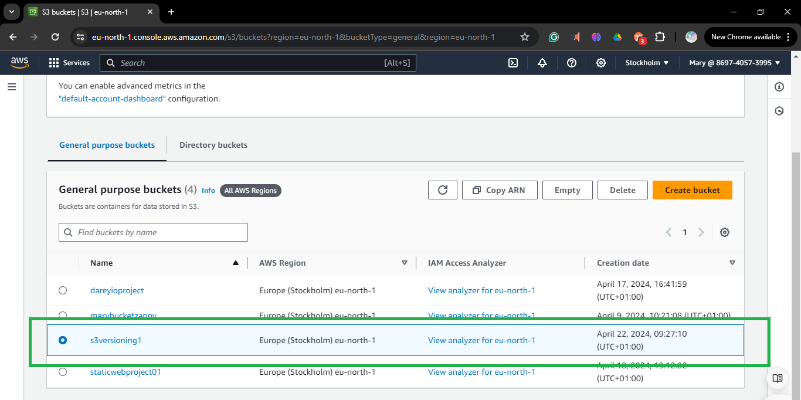
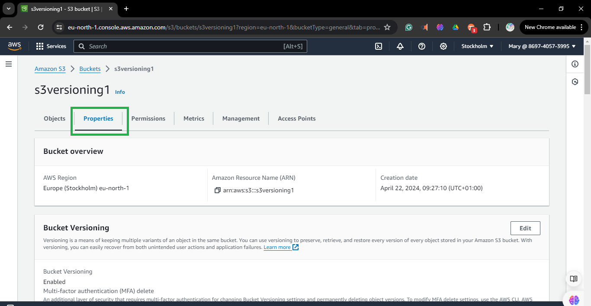
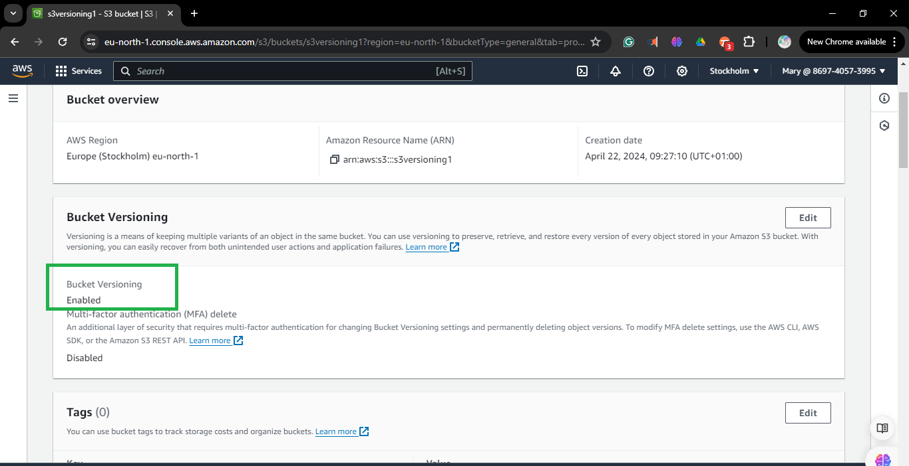
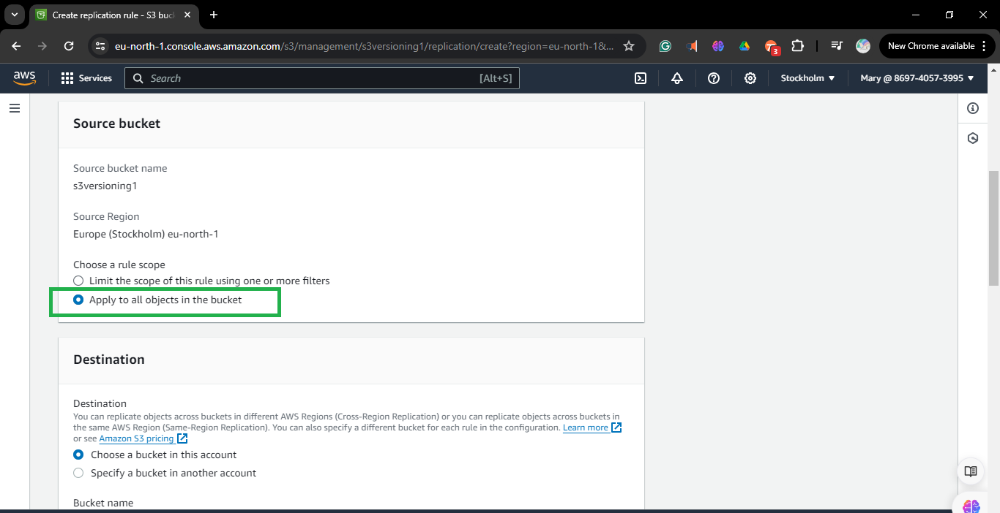
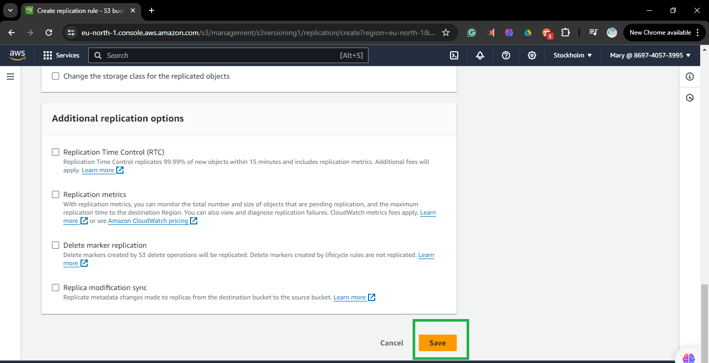
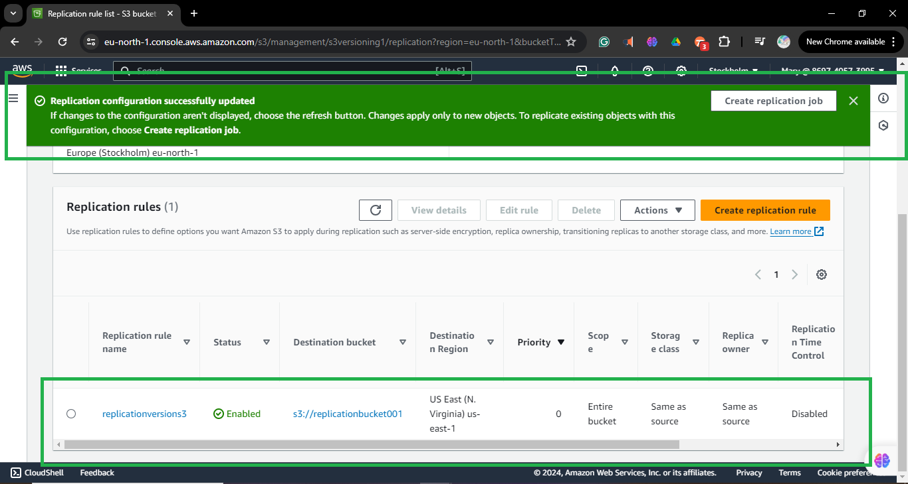
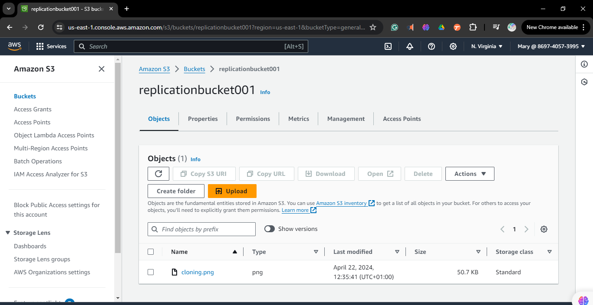
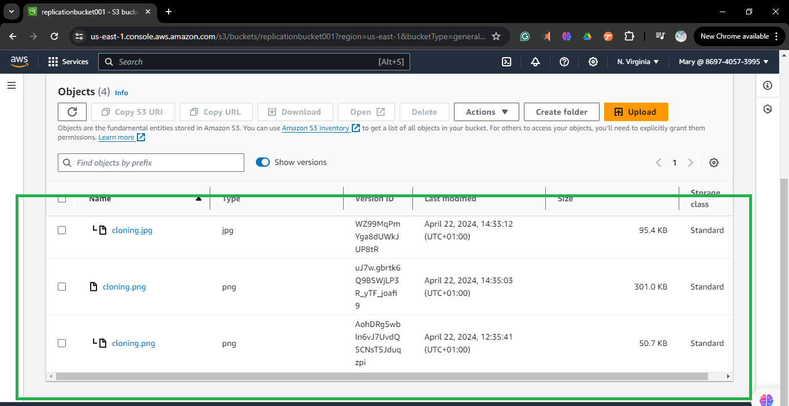

# S3 Versioning and Replication

**Amazon S3 Cross Region Replication enables replicating objects from a source bucket to a destination bucket in a different AWS region. This can help with compliance, reduce latency, and improve operational efficiency.**


1. **Log in to the AWS Management Console.**
   ```
   Open your web browser and go to (https://aws.amazon.com/console/).
   Enter your username and password.
   Click "Sign In".
   ```
2. **Navigate to the S3 service:**
   ```
   Once logged in, on the search tab at the top of the AWS Management Console,
   Type in "S3" and select "Amazon S3" from the search results.
   ```

3. **Click the "Create bucket" button:**
   ```
   In the Amazon S3 dashboard, click the "Create bucket" button.
   This will open a new window where you can configure your bucket.
   ```
   

4. **Follow the prompts to configure the new S3 bucket:**
   
   **Bucket Name and Region:**
   ```
   Enter a unique bucket name.
   Select the region for your bucket.
   ```
   
   **Review:**
   
   **Create Bucket:**
   `Click the "Create bucket" button to finalize the process.`
   

5. **Confirmation:**
   Once the bucket is created, you'll see a confirmation message.
   You can now start uploading files to your new S3 bucket!
   

## Task 2: Enable Versioning

## Step 1: Navigate to the "Versioning" section in S3 bucket properties
- Find and click on "s3versioning1".
- Once inside the bucket, locate and click on the "Properties" tab.
  

## Step 2: Enable versioning for the S3 bucket
- Scroll down or navigate to the "bucket Versioning" section.
- Click on the option to enable versioning for the bucket.

## Step 3: Confirm versioning configuration
- After enabling versioning, AWS will display a confirmation dialog or message.
- Review the information to ensure that versioning has been successfully enabled for the S3 bucket.
  


## Task 3: Configure Cross-Region Replication

## Step 1: Navigate to the "Management" tab in S3 bucket properties
- Find and click on the name of the S3 bucket you want to configure cross-region replication for.
- Inside the bucket, locate and click on the "Management" tab. This tab contains various management settings for the bucket.

## Step 2: Click on "Replication" and configure cross-region replication
- Within the "Management" tab, look for the "Replication rule" option and click on it.
- You'll be presented with the configuration settings for cross-region replication.
- the first step is to create a name for our replication rule
- make sure that the status of the rule is enabled
- change the source bucket to `apply to all objects in the bucket`
  
- **Destination Region:** Choose another region where you want to replicate the data.
   *note* *I created another bucket in another region as a destination*
  - **IAM Role:** Create a new IAM role or select an existing IAM role that grants permission for replication. This role should have permissions to read from the source bucket and write to the destination bucket. *note:* *I chose to create a new role for this project*

- save replication rule.



## Step 5: Verify replication configuration
- You can monitor the replication status and progress in the S3 Management Console.


## Task 4: Test Versioning

## Step 1: Upload an object to the S3 bucket
- Select the S3 bucket "s3versioning" where versioning is enabled.
- Click on the "Upload" button to upload an object (file) to the bucket.
- Follow the prompts to select the file from your local system and upload it to the bucket.
  
  
## Step 2: Modify the object and observe versioning behavior
- After the initial upload, modify the uploaded object. I uploaded an image with the same name "cloning"
- Save the modifications and ensure that the changes are reflected in the object.


## Step 3: Check the version history of the object
- Navigate back to the S3 Management Console and select the "s3versioning1" bucket.
- Locate the object that you uploaded and modified.
- Click on the object's name to view its details.
- In the object details view, find the section related to versioning or version history.
- Here, you should see a list of versions of the object, including the initial upload and any subsequent modifications.
- Observe the version history to confirm that multiple versions of the object are being retained.
  


