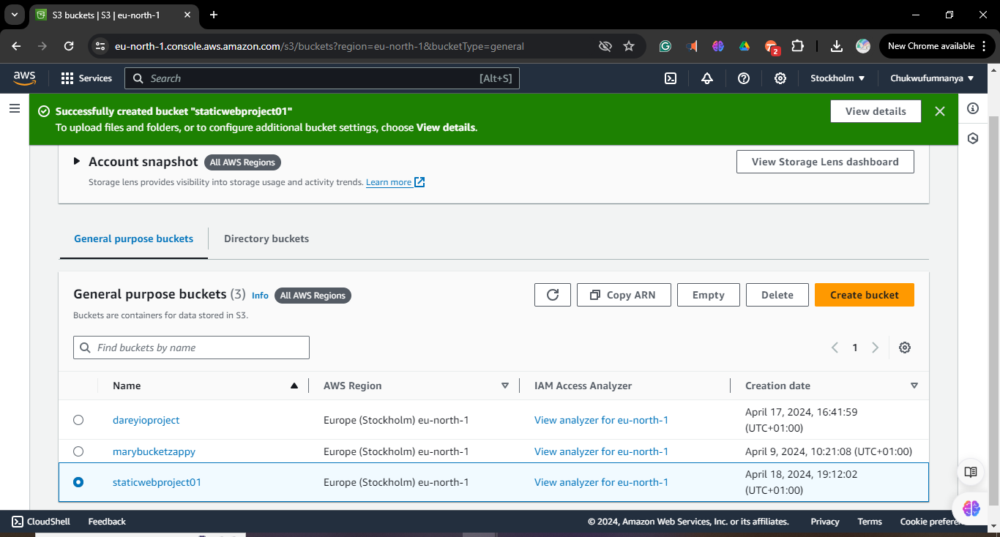
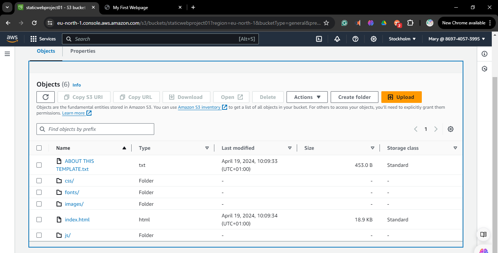
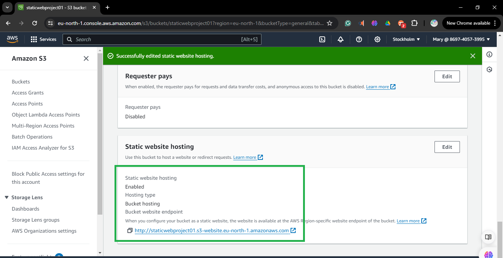

# S3 Static Web Hosting

1. **Log in to the AWS Management Console.**
   ```
   Open your web browser and go to (https://aws.amazon.com/console/).
   Enter your username and password.
   Click "Sign In".
   ```
2. **Navigate to the S3 service:**
   ```
   Once logged in, on the search tab at the top of the AWS Management Console,
   Type in "S3" and select "Amazon S3" from the search results.
   ```

3. **Click the "Create bucket" button:**
   ```
   In the Amazon S3 dashboard, click the "Create bucket" button.
   This will open a new window where you can configure your bucket.
   ```
   

4. **Follow the prompts to configure the new S3 bucket:**
   
   **Bucket Name and Region:**
   ```
   Enter a unique bucket name.
   Select the region for your bucket.
   ```
   
   **Review:**
   
   **Create Bucket:**
   `Click the "Create bucket" button to finalize the process.`
   

5. **Confirmation:**
   Once the bucket is created, you'll see a confirmation message.
   You can now start uploading files to your new S3 bucket!
   
   
6. ## Task 2: Upload Static Website Content

1. **Gather HTML, CSS, and other static content files for your website.**
    - Ensure you have all the necessary files for your static website, including HTML pages, CSS stylesheets, JavaScript files, images, etc.
    - Organize these files into a directory on your local machine for easier upload.

2. **Upload these files to your S3 bucket.**
    - Open the AWS Management Console and navigate to the S3 service.
    - Locate and click on the S3 bucket you created for your website.
    - Inside the bucket, you'll see an interface where you can manage your objects (files).
    - Click on the "Upload" button to start the upload process.
    - In the upload interface:
        - Click on the "Add files" or "Add folder" button to select the HTML, CSS, and other static content files from your local machine.
        - You can also drag and drop files directly into the upload interface.
        - Once all files are selected, click on the "Upload" button to begin the upload process.
      - After the upload is complete, you'll see your files listed in the S3 bucket interface.
        

7. ## Task 3: Configure S3 for Static Website Hosting

1. **In the S3 bucket properties, navigate to the "Static website hosting" section.**


2. **Choose "Use this bucket to host a website" and configure the index document.**
    - Scroll down to find the "Static website hosting" section.
    - Click on the "Edit" button or directly on the "Static website hosting" tab.
    - Select the option "Use this bucket to host a website".
    - Specify the index document. This is the file that will serve as the entry point when someone accesses your website. Common index          documents include `index.html` or `home.html`.
    - After configuring the index document, click on the "Save changes" button to apply the settings.
      

## Task 4: Access the Static Website

1. **Obtain the provided endpoint URL from the S3 bucket properties.**
    - In the bucket properties, locate the "Static website hosting" section.
    - You'll find an endpoint URL provided. Copy this URL.
      

2. **Access the static website using the provided endpoint and verify that it displays correctly.**
    - Open a web browser.
    - Paste the copied endpoint URL into the address bar and press Enter.
    - The browser should now load your static website.
  


