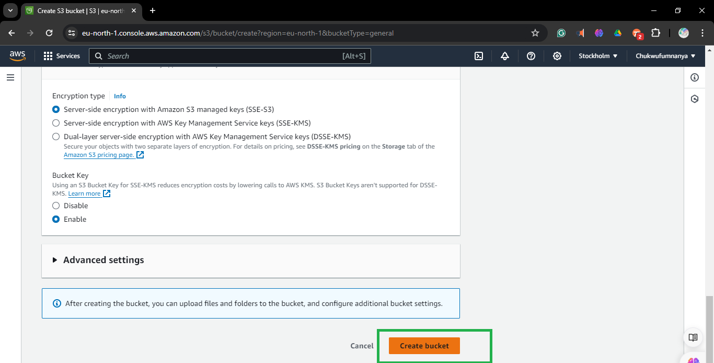
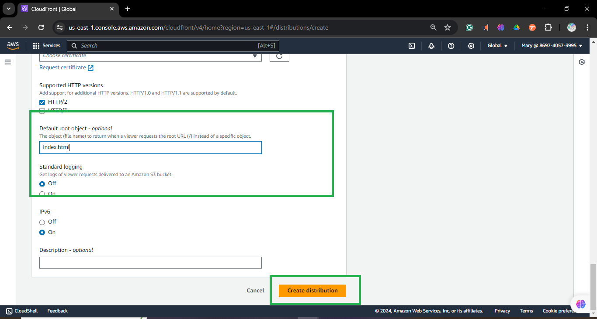

# S3 bucket policy for CloudFront Access

Purpose:

In this mini project, you will configure an S3 bucket policy that allows access only from a specific CloudFront distribution. This ensures that your S3 content is securely served through CloudFront, and direct access to the S3 bucket is restricted


1. **Log in to the AWS Management Console.**
   ```
   Open your web browser and go to (https://aws.amazon.com/console/).
   Enter your username and password.
   Click "Sign In".
   ```
2. **Navigate to the S3 service:**
   ```
   Once logged in, on the search tab at the top of the AWS Management Console,
   Type in "S3" and select "Amazon S3" from the search results.
   ```

3. **Click the "Create bucket" button:**
   ```
   In the Amazon S3 dashboard, click the "Create bucket" button.
   This will open a new window where you can configure your bucket.
   ```
   

4. **Follow the prompts to configure the new S3 bucket:**
   
   **Bucket Name and Region:**
   ```
   Enter a unique bucket name.
   Select the region for your bucket.
   ```
   
   **Review:**
   
   **Create Bucket:**
   `Click the "Create bucket" button to finalize the process.`
   

5. **Confirmation:**
   Once the bucket is created, you'll see a confirmation message.
   You can now start uploading files to your new S3 bucket!
   
   

   ## Task 2: Create a CloudFront Distribution

1. **Navigate to CloudFront Service:**
   - Go to the CloudFront service.

2. **Initiate Creation of Distribution:**
   - On the CloudFront dashboard, locate and click the "Create Distribution" button.
     
   
4. **Configure Distribution Settings:**
   - **Origin Settings:**
     - Choose your S3 bucket as the origin.
     - `use website endpoint`
     - select Origin access control settings (recommended)
     

   **Create new OAC[Origin access control]**
    
     
   **Default Cache Behavior Settings:**
   - leave as seen 
   **Web Application Firewall[WAF]**
   - choose `do not enable security protection`
     
   
6. **Optional Settings Configuration:**
   - **Cache Behavior Settings:**
   - Configure cache behaviors for specific paths or patterns, if needed.
   - **Distribution Settings:**
   - Adjust default settings such as price class, IPv6 support, and comment.
   - set `index.html` as the default root object
   
   

7. **Review and Create:**
   - After configuring the settings, review your choices to ensure everything is set up correctly.
   - Click the "Create Distribution" button to initiate the creation process.
   - 
## Copy the generated s3 bucket policy to notepad

9. **Verify Configuration:**
   - Once deployed, verify the CloudFront distribution's settings and functionality by accessing the provided domain name or endpoint.

## Task 2: Configure Static Website Hosting

1. **Navigate to S3 Bucket Properties:**
   - Go to the S3 service.

2. **Select the Desired Bucket:**
   - Choose the S3 created for this project

3. **Navigate to Static Website Hosting Section:**
   - Within the bucket properties, locate and click on the "Properties" tab.

4. **Enable Static Website Hosting:**
   - Scroll down to find the "Static website hosting" section.
   - Click on it to expand the options.

5. **Configure Index Document:**
   - Check the option to enable static website hosting.
   - Enter the name of the index document in the designated field (e.g., index.html).
   - Optionally, specify an error document if needed.

6. **Save Changes:**
   - After configuring the settings, scroll down and click the "Save" button or equivalent to apply the changes.

7. **Verify Configuration:**
   - Once saved, verify that static website hosting is enabled and the index document is correctly configured by accessing the provided endpoint or domain name.


## Task 4: Configure S3 Bucket Policy

1. **Access Permissions Tab:**
   - Select the S3 bucket created for this project.
   - Click on the "Permissions" tab to access bucket permissions.

2. **Configure Bucket Policy:**
   - Under the "Permissions" tab, locate the "Bucket Policy" section.
   - Click on "Bucket Policy" to configure a new policy.

3. **S3 Bucket Policy:**
   - Below is the bucket policy generated.
     
```
{
    "Version": "2008-10-17",
    "Id": "PolicyForCloudFrontPrivateContent",
    "Statement": [
        {
            "Sid": "AllowCloudFrontServicePrincipal",
            "Effect": "Allow",
            "Principal": {
                "Service": "cloudfront.amazonaws.com"
            },
            "Action": "s3:GetObject",
            "Resource": "arn:aws:s3:::mysecondcloudfronts3/*",
            "Condition": {
                "StringEquals": {
                    "AWS:SourceArn": "arn:aws:cloudfront::869740573995:distribution/E2HUOYJ52KVFV2"
                }
            }
        }
    ]
}
```
## Task 5: Test Access Restrictions

1. **Attempt Direct Access to S3 Object:**
   - Copy the S3 URL of an object stored in the bucket (e.g., `http://mysecondcloudfronts3.s3-website-us-east-1.amazonaws.com`).
   - Paste the URL into a web browser and attempt to access the object directly.
   - The access should be restricted, and you should receive an error or access denied message.

2. **Access Object Through CloudFront Distribution:**
   - Use the CloudFront distribution URL to access the same object.
   - Using the CloudFront distribution domain (e.g., `https://d2xaldklp25ip5.cloudfront.net`).
   - Paste the CloudFront distribution URL into a web browser and access the object.
   - The object should be accessible, indicating that access is allowed through the CloudFront distribution.

3. **Verify Access Restrictions:**
   - Compare the results of accessing the object directly from the S3 bucket URL and through the CloudFront distribution URL.
   - Confirm that direct access to the S3 URL is restricted while access through the CloudFront distribution URL is permitted.


