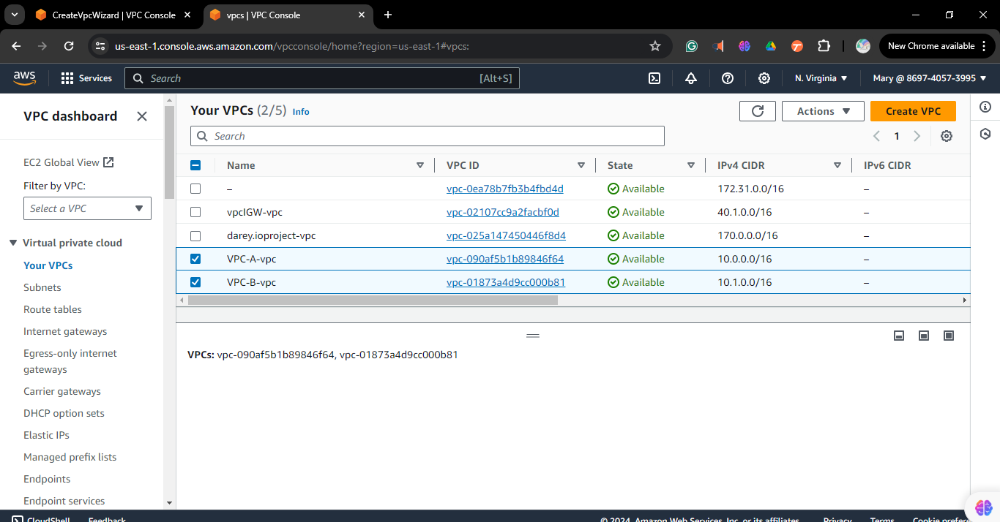
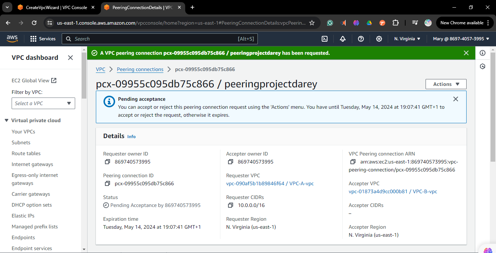
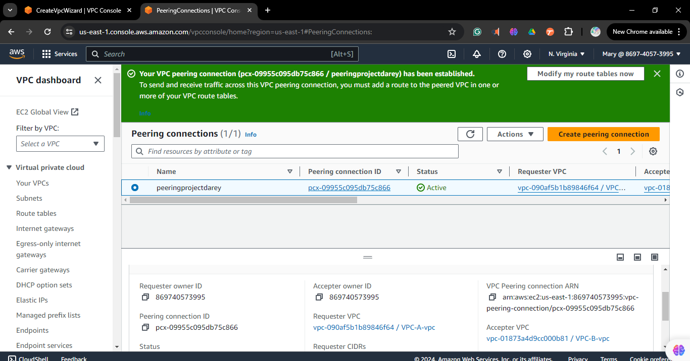
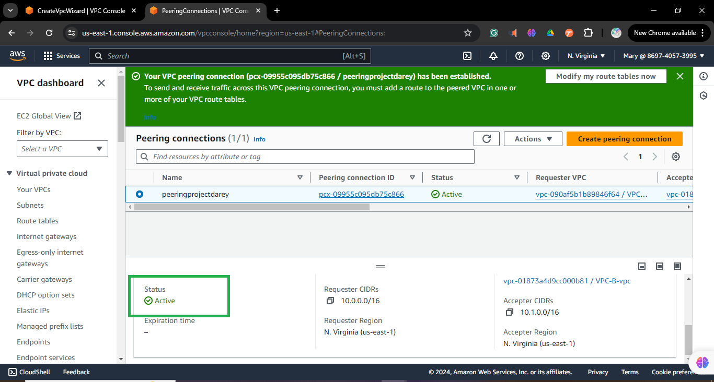

# VPC Peering with security group configuration 

## Task 1: Create Two VPCs

1. **Navigate to the VPC service**
   - In the AWS Management Console, search for "VPC".
   - Once in the VPC dashboard, locate and click on "Your VPCs" in the left navigation pane.

4. **Create VPC-A**
   - Click the "Create VPC" button.
   - Fill out the required information for VPC-A:
   - **Name tag:** Enter "VPC-A" as the name tag.
   - **IPv4 CIDR block:** Define an appropriate CIDR block for VPC-A.
   - Click "Create VPC" to create VPC-A.

5. **Create VPC-B**
   - Again, click the "Create VPC" button.
   - Fill out the required information for VPC-B:
   - **Name tag:** Enter "VPC-B" as the name tag.
   - **IPv4 CIDR block:** Define an appropriate CIDR block for VPC-B. Make sure it's different from VPC-A's CIDR block.
   - Click "Create VPC" to create VPC-B.

6. **Verify Creation**
   - After creating both VPCs, you should see them listed under "Your VPCs" in the VPC dashboard.
    

7. **Create public and private subnets each for VPC-A and VPC-B
   [how to create subnet](https://github.com/Fumnanya92/Darey.io_Projects/blob/main/Cloud_Services/Aws/Creating-subnet-on-Aws.md)
   

## Task 2: Initiate VPC Peering Connection

1. **Navigate to the Peering Connections section**
   - Go to the VPC dashboard.
   - Click on "Peering Connections" in the left navigation pane.

2. **Create Peering Connection in VPC-A**
   - Click the "Create Peering Connection" button in the Peering Connections section.
   - Specify the details for the peering connection:
     - **Name tag:** 
     - **VPC (Requester):** Select VPC-A from the dropdown list.
     - **VPC (Accepter):** Select VPC-B.
   - Click "Create Peering Connection" to initiate the peering connection.
      

   3. **Verify Peering Connection**
   - Once initiated, the peering connection request will be pending.
   - The owner of VPC-B needs to accept the peering connection request from their end.
   - After acceptance, the peering connection status will change to "Active".

## Task 3: Accept VPC Peering Connection

1. **Navigate to the Peering Connections section in VPC-B**
   - Go to the VPC dashboard.
   - Click on "Peering Connections" in the left navigation pane.

2. **Accept Peering Request from VPC-A**
   - In the Peering Connections section, select the pending peering connection request.
   - Click the "Actions" dropdown menu.
   - Choose "Accept Request" to accept the peering connection request.
     

3. **Confirm Acceptance**
   - A confirmation dialog will appear. Review the details to ensure it's the correct peering connection request.
   - Click "Yes, Accept" to confirm and accept the peering connection request.
     

4. **Verify Peering Connection**
   - After accepting the peering connection request, the status of the connection will change to "Active".
   - You can verify the successful establishment of the peering connection by checking the status in the Peering Connections section.
    

## Task 4: Configure Security Groups

1. **Navigate to the Security Groups section in the EC2 Dashboard**
   - Go to the EC2 dashboard.
   - Click on "Security Groups" in the left navigation pane.

2. **Create a New Security Group for Instances in VPC-A**
   - In the Security Groups section, click the "Create Security Group" button.
   - Specify the details for the security group:
     - **Security group name:** Enter a descriptive name for the security group.
     - **Description:** Optionally, provide a brief description of the security group.
     - **VPC:** Select VPC-A from the dropdown list.
   - Click "Create" to create the security group.

3. **Configure Inbound and Outbound Rules**
   - After creating the security group, click on the newly created security group to configure its rules.
   - Configure inbound rules:
     - Click the "Inbound Rules" tab.
     - Click "Add Rule" and specify the following:
       - **Type:** Select the type of traffic you want to allow (e.g., SSH, HTTP, HTTPS).
       - **Source:** Define the source IP range or specific security group from which the traffic is allowed.
     - Repeat the above steps to add any additional inbound rules as needed.
   - Configure outbound rules:
     - Click the "Outbound Rules" tab.
     - Click "Add Rule" and specify the following:
       - **Type:** Select the type of traffic you want to allow (e.g., All traffic, Custom TCP rule, Custom UDP rule).
       - **Destination:** Define the destination IP range or specific security group to which the traffic is allowed.
     - Repeat the above steps to add any additional outbound rules as needed.

4. **Associate the Security Group with Instances in VPC-A**
   - Once you have configured the inbound and outbound rules, go to the "Instances" section in the EC2 dashboard.
   - Select the instances in VPC-A that you want to associate with the newly created security group.
   - Right-click on the selected instances, choose "Networking," and then select "Change Security Groups."
   - From the list of available security groups, select the newly created security group.
   - Click "Assign Security Groups" to associate the security group with the selected instances.

## Task 4: Configure Security Groups (Continued)

5. **Repeat the Process for Instances in VPC-B**
   - In the Security Groups section of the EC2 Dashboard, follow the same steps as before to create a new security group for instances in VPC-B.
   - Create the security group with a descriptive name, associate it with VPC-B, and configure the desired inbound and outbound rules.
   - Once the security group is created and configured, go to the "Instances" section in the EC2 dashboard.
   - Select the instances in VPC-B that you want to associate with the newly created security group.
   - Right-click on the selected instances, choose "Networking," and then select "Change Security Groups."
   - From the list of available security groups, select the newly created security group for VPC-B.
   - Click "Assign Security Groups" to associate the security group with the selected instances in VPC-B.

# Creating an internet gateway for the VCPs

## Task 5: Verify Connectivity

1. **Launch Instances in Each VPC**
   - Go to the EC2 dashboard.
   - Launch instances in both VPC-A and VPC-B.
   - Make sure to choose appropriate subnets within each VPC during instance launch.

2. **Configure Security Groups and Network ACLs**
   - Configure the security groups of the instances in VPC-A and VPC-B to allow traffic between them.
     - In the security group settings of each VPC, add inbound and outbound rules to allow desired traffic (e.g., SSH, HTTP, etc.) from/to the IP addresses or security groups of instances in the peered VPC.
   - Ensure that network ACLs (if any) associated with the subnets in each VPC also allow the necessary traffic between the instances in the peered VPCs.
     - Adjust inbound and outbound rules in the network ACLs to permit traffic between the subnets of VPC-A and VPC-B.

3. **Test Connectivity Between Instances**
   - Once the security groups and network ACLs are configured, test the connectivity between instances in VPC-A and VPC-B.
   - SSH into an instance in VPC-A from your local machine (using a terminal or SSH client) and ping or attempt to establish any other connection to an instance in VPC-B.
   - Similarly, SSH into an instance in VPC-B and try to establish a connection to an instance in VPC-A.
   - Verify that the connections are successful based on the configured security group rules.

Congratulations! You have verified connectivity between instances in VPC-A and VPC-B based on the configured security group rules.

