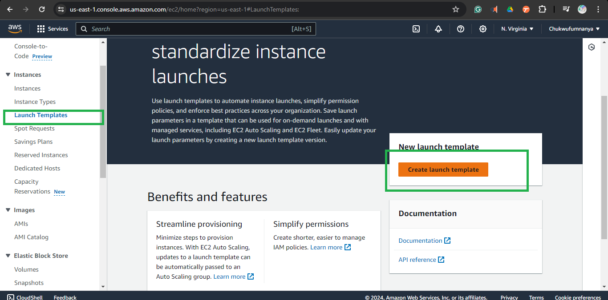

# Configuring Auto scaling with ALB using launch template

# Task 1: Create Launch Template

## Step 1: Log in to the AWS Management Console
- Open your web browser and go to [AWS Management Console](https://aws.amazon.com/console/).
- Enter your AWS account credentials (username and password) and click on "Sign In."

## Step 2: Navigate to the EC2 Service
- In the AWS Management Console, find the "Services" dropdown menu located at the top of the page.
- Select "EC2" from the list of services.

## Step 3: Access Launch Templates
- In the EC2 dashboard, look at the left navigation pane.
- Click on "Launch Templates" under the "Instances" section.

## Step 4: Create a New Launch Template
- Click the "Create launch template" button located at the top of the Launch Templates page.


## Step 5: Configure the Launch Template Settings
- **Template Name:** Enter a unique name for your launch template.
- **Template Version Description:** Provide a description.
- **Amazon Machine Image (AMI):** Choose an AMI from the list or enter the AMI ID.

```
  Create an AMI

 Step 1: Navigate to the EC2 Service
- In the AWS Management Console, find the "Services" dropdown menu located at the top of the page.
- Select "EC2" from the list of services.

 Step 3: Choose an Instance to Create the AMI From
- In the EC2 dashboard, click on "Instances" in the left navigation pane.
- Select the instance you want to create an AMI from.

 Step 4: Create the AMI
- With the instance selected, click on the "Actions" dropdown menu.
- Choose "Image and templates" and then "Create Image."
```

```
 Step 5: Configure the AMI Settings
- **Image Name:** Enter a unique name for your AMI.
- **Image Description (Optional):** Provide a description for the AMI.
- **No Reboot:** Decide whether to enable the "No Reboot" option. If unchecked, the instance will be stopped and rebooted to ensure a clean image.
- **Instance Volumes:** Review and configure the root volume and any additional volumes to be included in the AMI.
- Click the "Create Image" button to start the creation process.

 Step 6: Monitor the AMI Creation Process
- In the left navigation pane, click on "AMIs" under the "Images" section.
- You can monitor the status of your AMI in the AMIs dashboard. Once the status changes to "available," your AMI is ready to use.
```
  
- **Instance Type:** Select the desired instance type (e.g., t2.micro).
- **Key Pair:** Choose an existing key pair or create a new one for SSH access.
- **Network Settings:** Configure VPC, subnet, and other networking options.
- **Security Groups:** Select one or more security groups.
- **Storage (Volumes):** Configure the root volume and any additional volumes.
- **Advanced Details:**
  - **User Data:** Enter any user data scripts or cloud-init directives to run on instance launch.
  - **IAM Role:** Assign an IAM role if necessary.
  - **Monitoring, Tenancy, etc.:** Configure additional settings as needed.
  
- After configuring all necessary settings, click the "Create launch template" button at the bottom of the page to save your template.


