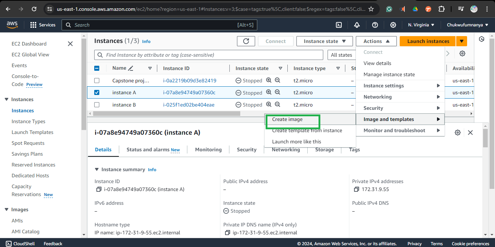
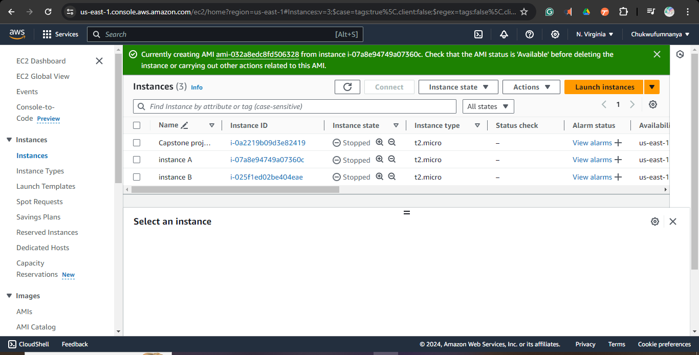
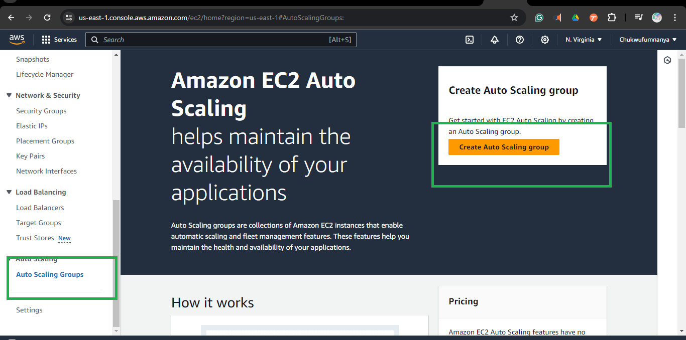

# Configuring Auto scaling with ALB using launch template

# Task 1: Create Launch Template

## Step 1: Log in to the AWS Management Console
- Open your web browser and go to [AWS Management Console](https://aws.amazon.com/console/).
- Enter your AWS account credentials (username and password) and click on "Sign In."

## Step 2: Navigate to the EC2 Service
- In the AWS Management Console, find the "Services" dropdown menu located at the top of the page.
- Select "EC2" from the list of services.

## Step 3: Access Launch Templates
- In the EC2 dashboard, look at the left navigation pane.
- Click on "Launch Templates" under the "Instances" section.

## Step 4: Create a New Launch Template
- Click the "Create launch template" button located at the top of the Launch Templates page.


## Step 5: Configure the Launch Template Settings
- **Template Name:** Enter a unique name for your launch template.
- **Template Version Description:** Provide a description.
- **Amazon Machine Image (AMI):** Choose an AMI from the list or enter the AMI ID.

```
  Create an AMI

 Step 1: Navigate to the EC2 Service
- In the AWS Management Console, find the "Services" dropdown menu located at the top of the page.
- Select "EC2" from the list of services.

 Step 2: Choose an Instance to Create the AMI From
- In the EC2 dashboard, click on "Instances" in the left navigation pane.
- Select the instance you want to create an AMI from.

 Step 3: Create the AMI
- With the instance selected, click on the "Actions" dropdown menu.
- Choose "Image and templates" and then "Create Image."
```

```
 Step 4: Configure the AMI Settings
- **Image Name:** Enter a unique name for your AMI.
- **Image Description (Optional):** Provide a description for the AMI.
- **No Reboot:** Decide whether to enable the "No Reboot" option. If unchecked, the instance will be stopped and rebooted to ensure a clean image.
- **Instance Volumes:** Review and configure the root volume and any additional volumes to be included in the AMI.
- Click the "Create Image" button to start the creation process.

 Step 5: Monitor the AMI Creation Process
- In the left navigation pane, click on "AMIs" under the "Images" section.
- You can monitor the status of your AMI in the AMIs dashboard. Once the status changes to "available," your AMI is ready to use.
```



 ## Step 6: Navigate back to the Launch template
 
- **Instance Type:** Select the desired instance type (e.g., t2.micro).
- **Key Pair:** Choose an existing key pair or create a new one for SSH access.
- **Network Settings:** Configure VPC, subnet, and other networking options.
- **Security Groups:** Select one or more security groups.
- **Storage (Volumes):** Configure the root volume and any additional volumes.
- **Advanced Details:**
  - **User Data:** Enter any user data scripts or cloud-init directives to run on instance launch.
  - **IAM Role:** Assign an IAM role if necessary.
  - **Monitoring, Tenancy, etc.:** Configure additional settings as needed.
- After configuring all necessary settings, click the "Create launch template" button at the bottom of the page to save your template.


# Task 2: Set Up Auto Scaling Group

## Step 1: Navigate to Auto Scaling Groups
- In the EC2 dashboard, look at the left navigation pane.
- Click on "Auto Scaling Groups" under the "Auto Scaling" section.

## Step 2: Create a New Auto Scaling Group
- Click the "Create Auto Scaling group" button located at the top of the Auto Scaling Groups page.


## Step 3: Choose a Launch Template
- Select the "Use Launch Template" option.
- From the dropdown menu, choose the launch template you created previously.

## Step 4: Configure Auto Scaling Group Settings
- **Group Name:** Enter a unique name for your Auto Scaling group.
- **Launch Template Version:** Select the appropriate version of the launch template if applicable.
- **Desired Capacity:** Specify the initial number of instances you want running in this group.
- **Minimum Capacity:** Set the minimum number of instances the group should maintain.
- **Maximum Capacity:** Set the maximum number of instances the group can scale out to.

## Step 5: Set Up Additional Configurations
- **Network Settings:**
  - Select the VPC where your instances will be launched.
  - Choose one or more subnets within the selected VPC for the instances.
- **Load Balancing (Optional):** 
  - If you have a load balancer, choose whether to attach it to your Auto Scaling group.
  - Select the appropriate target group or classic load balancer.
- **Scaling Policies:**
  - Configure policies to define how your Auto Scaling group scales in and out.
  - Set thresholds and actions based on CloudWatch alarms or custom metrics.
- **Instance Protection (Optional):** Enable instance protection to prevent specific instances from being terminated during a scale-in event.
- **Health Checks:**
  - Select whether to use EC2 or ELB health checks.
  - Set the health check grace period.

- After configuring all necessary settings, click the "Create Auto Scaling group" button at the bottom of the page to finalize the setup.


