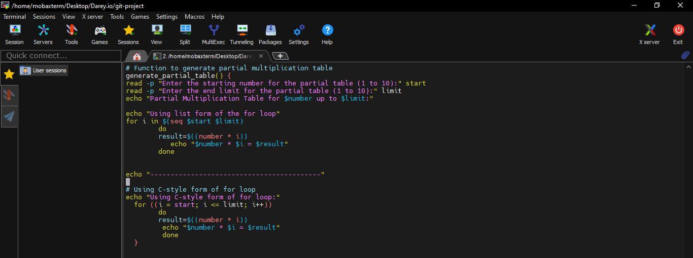
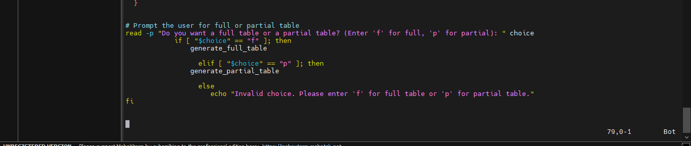
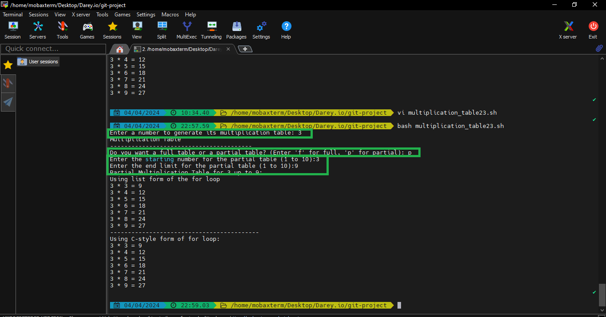
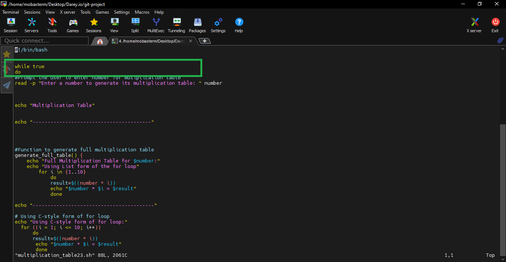

# Bash script for Generating a Multiplication Table

### User input for number: 
The script must first ask the user to input a number for which the multiplication table is to be generated 

### Choice of Table Range: 
ask the user if they want a full multiplication table (1 to 10) or a partial table. If they choose partial, prompt them for the start and end of the range

### Use of Loops:
Implement the logic to generate the multiplication table using loops. You may use either the list form or C-style for loop based on what's appropriate

### Conditional Logic: 
Use if-else statements to handle the logic based on the user's choices (full vs. partial table and valid range input).

### Input Validation: 
Ensure that the user enters valid numbers for the multiplication table and the specified range Provide feedback for invalid inputs and default to a full table if the range is incorrect

## Working: 
I start the script by prompting the user to enter a number for the multiplication table:

**read -p "Enter a number to generate its multiplication table: " number**

I then use **echo "multiplication Table for $number"** to print the header for the multiplication table.

### Writing the following line to generate the function *generate_full_table()* :

**List form of for loop:**
This loop iterates through the values of **i** from 1 to 10.
For each **i**, it calculates the result of **number * i** and prints the equation.

**C-style form of for loop:**
This loop initializes i to 1, runs the loop until i reaches 10, and increments i by 1 in each iteration.
It calculates the result of **number * i** and prints the equation.

**The *generate_full_table()* function generates the full multiplication table up to 10**

### Writing the following line to generate the function *generate_partial_table()* :

first **read -p "Enter the starting number for the partial table (1 to 10):" start** to collect the number for the starting range

then, I ask the user to enter the end limit for the range
**read -p "Enter the end limit for the partial table (1 to 10): " limit**

**echo "Partial Multiplication table for $number up to $limit:"** to display a header indicating the number for which the table is generated and the provided limit.

using the for loop to iterate through the numbers from **start** to **limit**
**list form**
I used the *seq* to generate a sequence of numbers from the value of **start** to **limit**

The loop iterates over each number in the generated sequence, where i takes each value from **start** to **limit** in increments of 1

For each value of **i**, the multiplication result is calculated **(result=$((number * i)))** and then printed **(echo "$number * $i = $result")**.

**c-style**
 On the C-style for loop, iterating through the numbers from **start** to **limit**, calculating the multiplication results, and displaying them.
 
 

### Finally
I write a script to prompt the user to choose a full or partial multiplication table 

**read -p "Do you want a full table or a partial table? (Enter 'f' for full, 'p' for partial): " choice**

*choice*: This is the variable where the user's input will be stored.
Then I proceed to check the value for *choice*.

**if [ "$choice" == "f" ]; then:** This line checks if the value of choice is equal to **"f"**(full). If it is, then it executes the following block of code, which calls the generate_full_table() function.

**elif [ "$choice" == "p" ]; then:** This line stands for "else if." It checks if the value of choice is equal to "p". If it is, then it executes the following block of code, which calls the generate_partial_table function.

else: This line is executed if neither of the previous conditions ("f" or "p") is true, In this case, it displays an error message:
**echo "Invalid choice. Please enter 'f' for full table or 'p' for partial table."**

Based on the user's choice, it calls the corresponding function.
If the user enters an invalid choice, it displays an error message.

## Execute

### Asking users if they want to run the program again
**Using While true** to restart the program 

and the bottom of the program write *Ask user if they want to run the program again*

`read -p "Press Enter to run the program again, or 'x' to exit: " restart_input`

#Exit the loop if the user inputs 'x'

if [ "$restart_input" == "x" ]; then

    echo "Exiting program..."
    
    break
    
fi

#Clear the terminal screen before restarting the loop

clear

done

