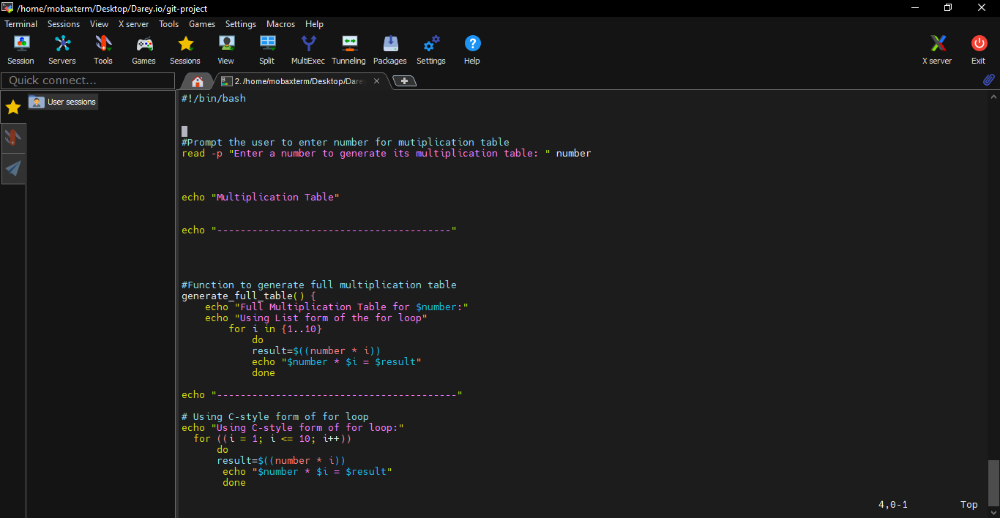

# Bash script for Generating a Multiplication Table

### user input for number: 
The script must first ask the user to input a number for which the multiplication table is to be generated 

### Choice of Table Range: 
Next, ask the user if they want a full multiplication table (1 to 10) or a partial table. If they choose partial, prompt them for the start and end of the range

### Use of Loops:
Implement the logic to generate the multiplication table using loops. You may use either the list form or C-style for loop based on what's appropriate

### Conditional Logic: 
Use if-else statements to handle the logic based on the user's choices (full vs. partial table and valid range input).

### Input Validation: 
Ensure that the user enters valid numbers for the multiplication table and the specified range Provide feedback for invalid inputs and default to a full table if the range is incorrect

## Working: 
I start the script by prompting the user to enter a number for the multiplication table:

**read -p "Enter a number to generate its multiplication table: " number**

I then use **echo "multiplication Table for $number"** to print the header for the multiplication table.

### Writing the following line to generate the function *generate_full_table()* :

**List form of for loop:**
This loop iterates through the values of **i** from 1 to 10.
For each **i**, it calculates the result of **number * i** and prints the equation.

**C-style form of for loop:**
This loop initializes i to 1, runs the loop until i reaches 10, and increments i by 1 in each iteration.
It calculates the result of **number * i** and prints the equation.

### Writing the following line to generate the function *generate_partial_table()* :

