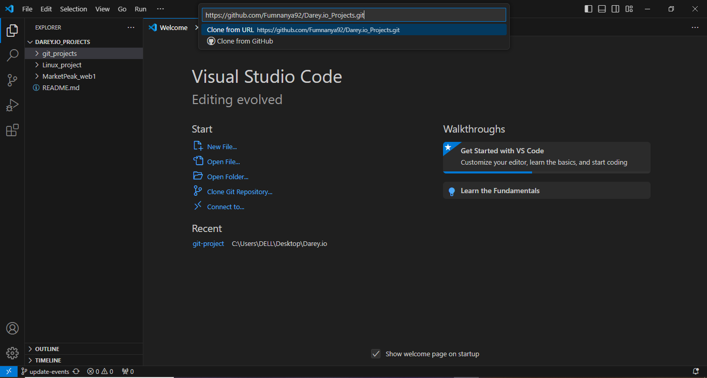

## Background Scenario

You're part of a development team tasked with enhancing the website for the "Greenwood Community Library." The website aims to be more engaging and informative for its visitors. It currently includes basic sections: Home, About Us, Events, and Contact Us. Your tham decides to add a "Book Reviews" section and update the "Events" page to feature upcoming community events.

You will simulate the roles of two contributors: "Morgan" and "Jamie". Morgan will focus on adding the "Book Reviews" section, while Jamie will update the "Events" page with new community events

### Setup

1. Create a Repository on GitHub:

``` Go to GitHub and log into your account.
Click on the "+" icon in the top-right corner and select "New repository".
Name the repository "greenwood-library-website".
Optionally, add a description.
Check the box for "Initialize this repository with a README".
Click "Create repository".
```

Tasks
### Step 2
with any terminal or git bash

Create a folder in your local machine(it can be any name): `mkdir vsc`
**cd** into the folder `cd vsc`

Create the following files using `touch`. e.g. `touch home.html`
```
Home.html
about_us.html
contact.html 
events.html
```

Step 3
Open Visual Studio Code (VS Code) and open the *vsc* and clone your git repository in there.
git clone https://github.com/Fumnanya92/Darey.io_Projects



1. In the main branch, using Visual Studio Code editor ensure there are files for each of the web pages.

**home.html,
about us.html,
events.html,
contact.html**
2. Stage, commit with `git add .` `git commit -m "Add initial web pages" `, and push `git push origin main
`the changes directly to the main branch. (This is a simulation of the team's existing code base for the website)

### Morgan's work
